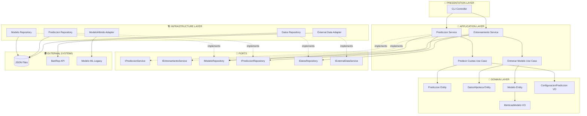

# 📐 Diagrama de Arquitectura Hexagonal

## Visión General del Sistema



## Flujo de Datos Detallado

### 1. Entrenamiento de Modelo

```
┌─────────────┐
│   Usuario   │
└──────┬──────┘
       │ "Entrenar modelo con datos.xlsx"
       ▼
┌─────────────────────┐
│   CLI Controller    │ ◄─── Presentation
└──────┬──────────────┘
       │ entrenar_modelo(ruta)
       ▼
┌─────────────────────┐
│ Entrenamiento       │ ◄─── Application
│ Service             │
└──────┬──────────────┘
       │ execute(datos)
       ▼
┌─────────────────────┐
│ Entrenar Modelo     │ ◄─── Use Case
│ Use Case            │
└──────┬──────────────┘
       │ create Modelo
       ▼
┌─────────────────────┐
│   Modelo Entity     │ ◄─── Domain
│ + MetricasModelo VO │
└──────┬──────────────┘
       │ guardar(modelo)
       ▼
┌─────────────────────┐
│ Modelo Repository   │ ◄─── Infrastructure
└──────┬──────────────┘
       │ persist
       ▼
┌─────────────────────┐
│   JSON Files        │ ◄─── External
└─────────────────────┘
```

### 2. Predicción de Cuotas

```
┌─────────────┐
│   Usuario   │
└──────┬──────┘
       │ "Predecir 6 meses"
       ▼
┌─────────────────────┐
│   CLI Controller    │ ◄─── Presentation
└──────┬──────────────┘
       │ predecir(config)
       ▼
┌─────────────────────┐
│ Prediccion Service  │ ◄─── Application
└──────┬──────────────┘
       │ execute(config)
       ▼
┌─────────────────────┐
│ Predecir Cuotas     │ ◄─── Use Case
│ Use Case            │
└──────┬──────────────┘
       │ obtener_modelo()
       ▼
┌─────────────────────┐
│ Modelo Repository   │ ◄─── Infrastructure
└──────┬──────────────┘
       │ get_activo()
       ▼
┌─────────────────────┐
│ ModeloHibrido       │ ◄─── Adapter
│ Adapter             │
└──────┬──────────────┘
       │ predecir()
       ▼
┌─────────────────────┐
│ Prediccion Entities │ ◄─── Domain
└──────┬──────────────┘
       │ guardar_lote()
       ▼
┌─────────────────────┐
│ Prediccion Repo     │ ◄─── Infrastructure
└──────┬──────────────┘
       │ persist
       ▼
┌─────────────────────┐
│   JSON/Excel Files  │ ◄─── External
└─────────────────────┘
```

## Componentes Principales

### Domain Layer (💎)

**Responsabilidad**: Lógica de negocio pura, sin dependencias externas

| Componente                | Tipo         | Responsabilidad                    |
| ------------------------- | ------------ | ---------------------------------- |
| `Prediccion`              | Entity       | Representa una predicción de cuota |
| `DatosHipoteca`           | Entity       | Datos mensuales de hipoteca        |
| `Modelo`                  | Entity       | Modelo ML entrenado                |
| `MetricasModelo`          | Value Object | Métricas de evaluación (inmutable) |
| `ConfiguracionPrediccion` | Value Object | Config de predicción (inmutable)   |

### Application Layer (🔧)

**Responsabilidad**: Orquesta casos de uso, implementa lógica de aplicación

| Componente              | Tipo     | Responsabilidad                    |
| ----------------------- | -------- | ---------------------------------- |
| `PrediccionService`     | Service  | Coordina predicciones              |
| `EntrenamientoService`  | Service  | Coordina entrenamiento             |
| `PredecirCuotasUseCase` | Use Case | Lógica específica de predicción    |
| `EntrenarModeloUseCase` | Use Case | Lógica específica de entrenamiento |

### Ports Layer (🔌)

**Responsabilidad**: Define interfaces (contratos)

**Input Ports** (hacia la aplicación):

- `IPrediccionService`
- `IEntrenamientoService`

**Output Ports** (desde la aplicación):

- `IModeloRepository`
- `IPrediccionRepository`
- `IDatosRepository`
- `IExternalDataService`

### Infrastructure Layer (🏗️)

**Responsabilidad**: Implementaciones concretas, integraciones

| Componente             | Tipo       | Implementa              |
| ---------------------- | ---------- | ----------------------- |
| `ModeloRepository`     | Repository | `IModeloRepository`     |
| `PrediccionRepository` | Repository | `IPrediccionRepository` |
| `DatosRepository`      | Repository | `IDatosRepository`      |
| `ExternalDataAdapter`  | Adapter    | `IExternalDataService`  |
| `ModeloHibridoAdapter` | Adapter    | Integra modelo legacy   |

### Presentation Layer (🎯)

**Responsabilidad**: Interacción con el usuario

| Componente      | Tipo       | Responsabilidad     |
| --------------- | ---------- | ------------------- |
| `CLIController` | Controller | Menú y comandos CLI |

## Principios SOLID Aplicados

### 1. Single Responsibility Principle (SRP)

```
✅ Cada clase tiene UNA responsabilidad:
- Prediccion: solo representa una predicción
- PrediccionRepository: solo persiste predicciones
- PredecirCuotasUseCase: solo lógica de predicción
```

### 2. Open/Closed Principle (OCP)

```
✅ Abierto para extensión, cerrado para modificación:
- Nueva fuente de datos: crear nuevo Adapter sin cambiar código existente
- Nueva UI: crear nuevo Controller sin cambiar Application
```

### 3. Liskov Substitution Principle (LSP)

```
✅ Cualquier implementación puede reemplazar a otra:
- PrediccionRepositoryJSON puede reemplazarse por PrediccionRepositorySQL
- Sin romper el código que usa IPrediccionRepository
```

### 4. Interface Segregation Principle (ISP)

```
✅ Interfaces pequeñas y específicas:
- IPrediccionService: solo predicciones
- IEntrenamientoService: solo entrenamiento
- No interfaces "gordas" con muchos métodos
```

### 5. Dependency Inversion Principle (DIP)

```
✅ Dependencias hacia abstracciones (interfaces):
- PrediccionService depende de IModeloRepository (interface)
- NO depende de ModeloRepository (implementación concreta)
```

## Ventajas de esta Arquitectura

### ✅ Testabilidad

```python
# Fácil crear mocks para tests
mock_repo = MockModeloRepository()
service = PrediccionService(mock_repo)
# Test sin base de datos real
```

### ✅ Mantenibilidad

```python
# Cambiar persistencia de JSON a SQL
# Solo modificar ModeloRepository
# Domain y Application sin cambios
```

### ✅ Escalabilidad

```python
# Agregar API REST
# Crear APIController
# Reusar Services existentes
```

### ✅ Independencia

```python
# No acoplado a:
# - Framework web específico
# - Base de datos específica
# - Librería ML específica
```

## Flujo de Dependencias

```
┌──────────────────────────────────────────────────┐
│  REGLA: Las dependencias apuntan hacia ADENTRO  │
└──────────────────────────────────────────────────┘

Presentation ──────────────────────────┐
                                       │
Infrastructure ───────────────┐        │
                              ↓        ↓
        Ports ────────────> Application
                              ↓
                           Domain
                          (NÚCLEO)

❌ NUNCA: Domain depende de Infrastructure
✅ SIEMPRE: Infrastructure depende de Domain (via Ports)
```

## Comparación: Antes vs Después

### Antes (Código Monolítico)

```python
class ModeloHipoteca:
    def cargar_datos(self, path):
        # Mezcla TODO:
        df = pd.read_excel(path)        # IO
        X = df[['capital', 'gastos']]   # Lógica
        modelo.fit(X, y)                 # ML
        joblib.dump(modelo, 'mod.pkl')  # Persistencia
```

**Problemas:**

- ❌ Difícil testear
- ❌ Acoplado a Excel
- ❌ Todo mezclado
- ❌ Difícil cambiar persistencia

### Después (Arquitectura Hexagonal)

```python
# Domain
class DatosHipoteca: pass

# Port
class IDatosRepository(ABC): pass

# Infrastructure
class DatosRepositoryExcel(IDatosRepository):
    def cargar(self):
        return pd.read_excel(...)

# Application
class EntrenarModeloUseCase:
    def __init__(self, repo: IDatosRepository):
        self.repo = repo
```

**Ventajas:**

- ✅ Fácil testear (mock repo)
- ✅ Cambiar Excel por SQL
- ✅ Separación clara
- ✅ Flexible

## Extensiones Futuras

### 1. API REST

```python
# Crear nueva capa de presentación
class APIController:
    def __init__(self, prediccion_service):
        self.service = prediccion_service

    @app.post("/predicciones")
    def crear(self, config):
        return self.service.predecir_cuotas_futuras(config)
```

### 2. Persistencia en Base de Datos

```python
# Nueva implementación de repositorio
class ModeloRepositorySQL(IModeloRepository):
    def guardar(self, modelo):
        session.add(ModeloORM.from_entity(modelo))
        session.commit()
```

### 3. Nuevos Modelos ML

```python
# Nuevo adaptador
class ModeloLSTMAdapter:
    def predecir(self, config):
        # Implementación con LSTM
        pass
```

---

**Nota**: Esta arquitectura permite evolucionar el sistema sin romper código existente.
